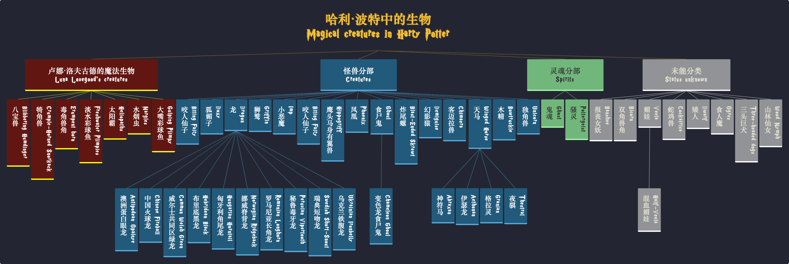

# vue-tree-diagram

A simple component for render tree diagram for Vue.js

## Privew



## Install
  
  `npm install vue-tree-diagram`

## Example

<details>
  <summary><b>Example</b> (click to show)</summary>

  ```html
  <template>
    <tree-diagram :data="data" @node-click="handleNodeClick">
      <template v-slot:type-root="{value}">
        <div class="type-root">
          <h1>{{value.title}}</h1>
        </div>
      </template>
      <template v-slot:type-a="{value}">
        <div class="type-a">
          <h1>{{value.title}}</h1>
        </div>
      </template>
      <template v-slot:default="{value}">
        <div class="type-b">
          <h1>{{value.title}}</h1>
          <h2>{{value.subtitle}}</h2>
        </div>
      </template>
    </tree-diagram>
  </template>

  <script>
    import TreeDiagram from "vue-tree-diagram"
    export default {
      data() {
        return {
          components: { TreeDiagram },
          data: [
            {
              id: 1,
              type: "type-root",
              value: { title: "ROOT" },
              children: [{
                id: 2,
                type: "type-a",
                value: { title: "NodeA" },
                children: [{
                  id: 3,
                  type: "type-b",
                  value: { title: "NodeB", subtitle: "NodeB subtitle" }
                }]
              }]
            }
          ]
        }
      },
      methods: {
        handleNodeClick(node) { 
          console.log(node)
        }
      }
    }
  </script>
  ```

</details>

## API

### Attributes

  | Attribute	| Description |	Type | Accepted Values | Default |
  | -	| - |	- | - | - | - |
  | data	| tree data |	Array | - | - |
  | nodePad	| space of node to node |	Number | - | 1 |
  | levelPad	| space of row to row |	Number | - | 10 |
  | direction	| tree direction |	String | 't-b', 'l-r' | 't-b' |
  | align	| node align in each row |	String | 'start', 'center', 'end' | 'start' |

### Events

  | Event Name	| Description | Parameters |
  | -	| - |	- |
  | node-click	| triggers when a node is clicked	| (node, event) |
  | before-render-tree | triggers when start render tree | - |
  | after-render-tree	| triggers when tree render finished | - |